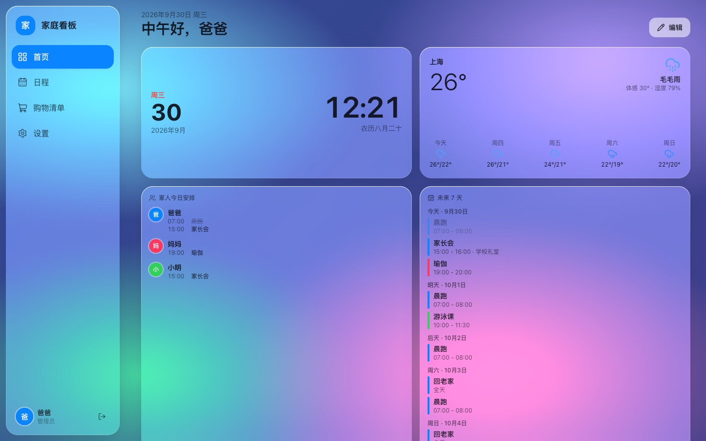
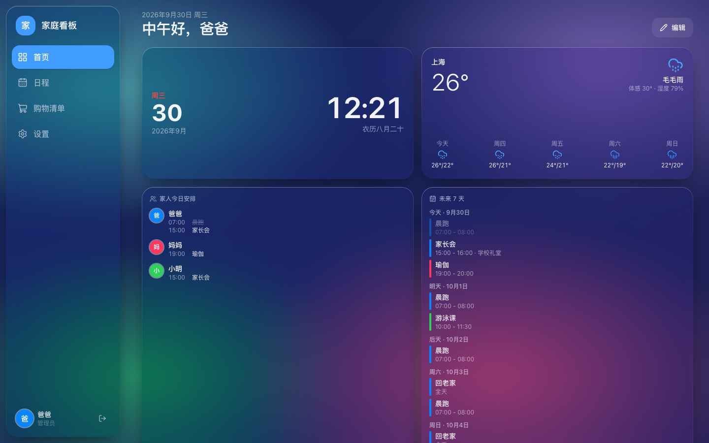
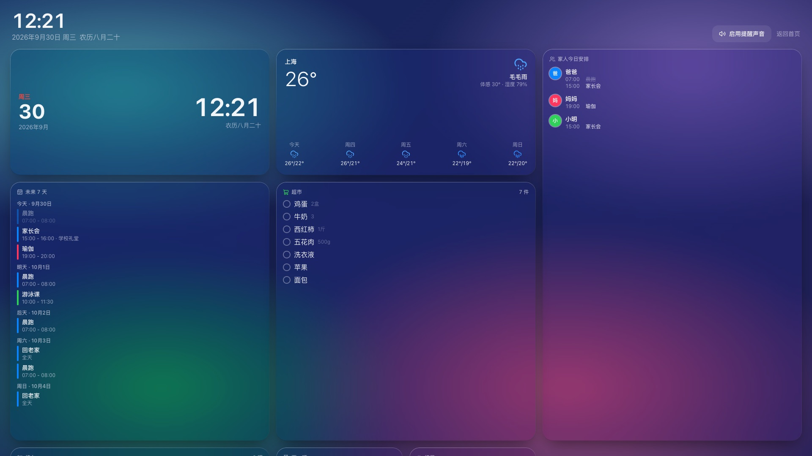
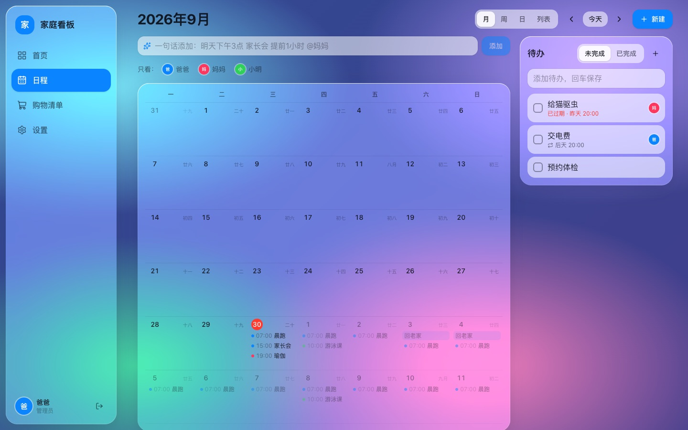
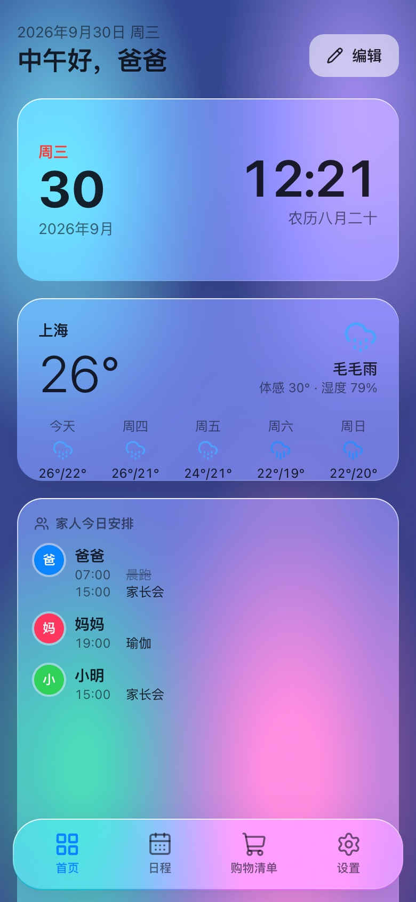
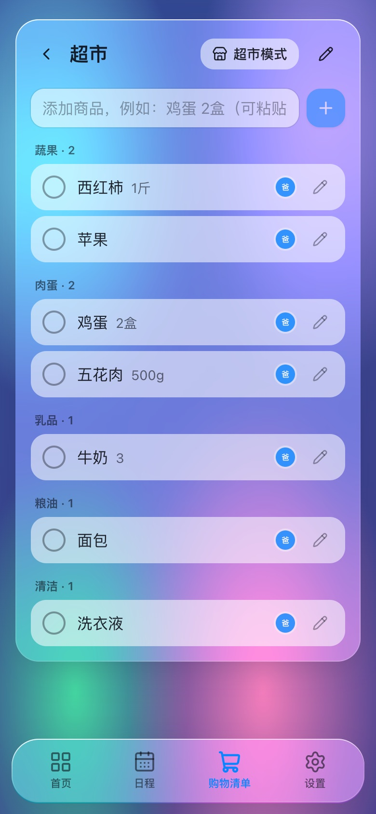

# 家庭看板 Family Dashboard

部署在家用 NAS 或小服务器上、全家共用的信息大屏：可拖拽的小卡片首页、家庭日程与提醒、实时同步的购物清单，液态玻璃（Liquid Glass）风格，手机、平板、电脑和挂墙大屏共用一套页面。



| 深色主题 | 挂墙大屏 |
| --- | --- |
|  |  |

| 日程 | 手机首页 | 手机购物清单 |
| --- | --- | --- |
|  |  |  |

## 功能

- **卡片首页**：iOS 风格的小卡片，可拖拽排序、切换 S / M / L / XL 尺寸、从卡片库添加；全家共用一个布局，挂墙平板显示的也是它。点击卡片从右侧抽屉快速操作
- **日程与待办**：月 / 周 / 日 / 列表四种视图，重复日程支持「仅此一次 / 此次及以后 / 全部」三种修改范围；按成员着色和筛选；待办可指派、可重复
- **一句话添加**：输入「明天下午3点 家长会 提前1小时 @妈妈」自动识别时间、提醒和参与人，本地规则解析，不依赖大模型
- **提醒**：到点后在打开的页面和挂墙大屏上弹窗并响铃，支持「稍后 10 分钟」；离线期间错过的提醒重新打开后补齐
- **购物清单**：多个清单、自动归类、常买联想、批量粘贴、左滑删除；多台设备实时同步；超市模式大字号且屏幕常亮
- **多用户**：每人一个账号，日程、待办、清单都可设为「全家共享」或「私有」
- **挂墙大屏模式**：配对码登录的只读设备，屏幕常亮、夜间调暗或只显示大时钟、每晚自动刷新
- **主题**：液态玻璃浅色 / 深色、经典、极简、大屏高对比五套主题，可换壁纸，夜间自动切深色，低端平板可开性能模式
- **PWA**：可安装到手机和平板桌面，离线时仍能查看最近的数据
- **天气卡片**：Open-Meteo 免费数据，无需申请密钥

## 技术栈

- 后端：[Bun](https://bun.sh) + [Hono](https://hono.dev) + SQLite（[Drizzle ORM](https://orm.drizzle.team)），单进程、单数据库文件，不依赖 Redis 等外部服务
- 前端：React 19 + Vite + Tailwind CSS v4 + TanStack Query + wouter，首屏 JS 约 138KB（gzip）
- 实时：SSE（Server-Sent Events）
- 部署：单个 Docker 容器，GitHub Actions 自动构建多架构镜像（GHCR / 阿里云），可通过内网 IP + 端口访问，按需用反向代理提供 HTTPS

详细设计见 [技术设计文档](docs/TECH_DESIGN.md)。

## 部署

需要一台能运行 Docker 的 NAS 或 Linux 主机。镜像由 GitHub Actions 自动构建（支持 amd64 和 arm64），服务器上只需要一个 `docker-compose.yml`：

```bash
mkdir family-dashboard && cd family-dashboard
curl -fsSLO https://raw.githubusercontent.com/dddyszy/family-dashboard/master/docker-compose.yml
# 编辑 docker-compose.yml，在 environment 中填写 APP_SECRET（openssl rand -hex 32 生成）
# 配置 HTTPS 后，同样在 environment 中填写 PUBLIC_URL
docker compose up -d
```

启动后访问 `http://服务器IP:8686`。升级只需 `docker compose pull && docker compose up -d`。切换镜像源或固定版本时直接修改 Compose 的 `image`；阿里云镜像需维护者已实际发布，见 [镜像自动构建](docs/CI_IMAGE.md)。

内网可直接通过 HTTP 初始化、登录，使用日程、购物清单和实时同步，`PUBLIC_URL` 保持为空。HTTP 下不支持 Service Worker、离线缓存和 Wake Lock，PWA 安装也受限；当前新增首页卡片使用 `crypto.randomUUID()`，同样需要 HTTPS。需要这些功能时再配置反向代理。

两种访问方式的步骤见：

- [群晖 Synology 部署指南](docs/DEPLOY_SYNOLOGY.md)（IP 直连 / 可选 DSM 反向代理和证书）
- [飞牛 fnOS 部署指南](docs/DEPLOY_FNOS.md)（IP 直连 / 可选 Nginx Proxy Manager，其他 Linux / NAS 也可参考）

数据保存在 `data/` 目录中，每天凌晨 2 点自动备份，保留最近 7 份。管理员可以在「设置 → 数据」中手动备份、导出 JSON，或一键重置数据（清空数据 / 恢复出厂，执行前自动备份）。

## 本地开发

先安装 [Bun](https://bun.sh)（1.4 以上）。

```bash
bun install
bun dev          # 前端 http://localhost:5288 ，后端 http://localhost:8686
bun run check    # 格式检查 + 类型检查 + 单元测试，提交前必须通过
```

第一次打开会引导创建管理员账号。开发模式下 Service Worker 默认关闭，需要调试 PWA 时使用 `bun run preview`（http://localhost:8686）。

更多命令和代码规范见 [AGENTS.md](AGENTS.md)。

## 目录结构

```
apps/
  server/     Hono 服务：路由、业务逻辑、数据库、定时任务、SSE
  web/        React 单页应用：首页卡片、日程、购物清单、设置、大屏模式
packages/
  shared/     前后端共用的 zod schema、类型、时区与重复规则工具
docker/       Dockerfile
.github/      镜像自动构建工作流
docs/         技术设计、部署指南、截图
```

## 路线图

第一期（当前版本）已完成上面列出的功能。第二期计划：

- 手机推送（ntfy / Web Push）、每日日程摘要、免打扰时段
- 会员订阅：各网站和 App 的会员有效期、到期提醒、花销统计
- 大模型 Token 用量：OpenAI、Anthropic、DeepSeek 等的用量与余额
- 跨模块汇总卡片：会员总花销、Token 总用量
- 周视图和日视图中拖拽调整日程时间

## 分支

- `master`：稳定版本
- `dev`：日常开发，功能完成并验证后合并到 `master`
