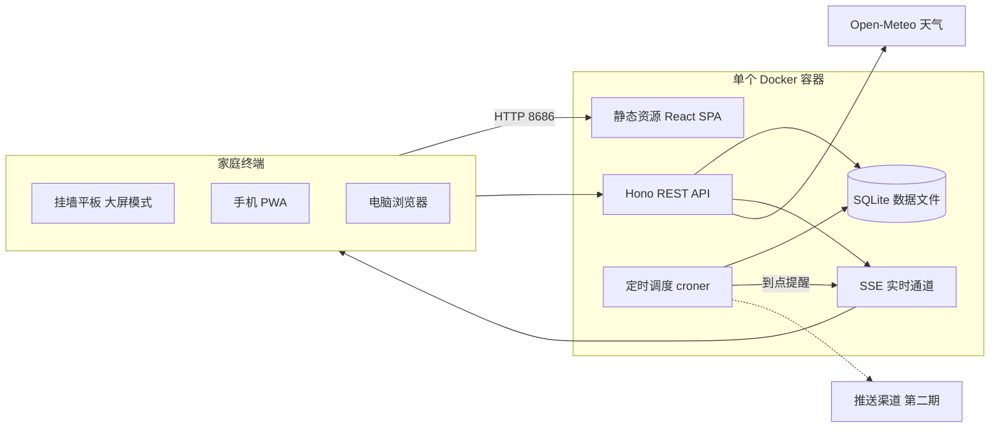
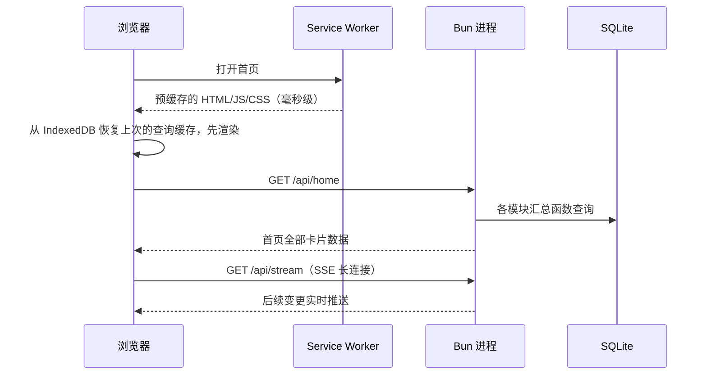
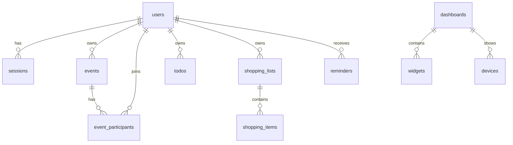
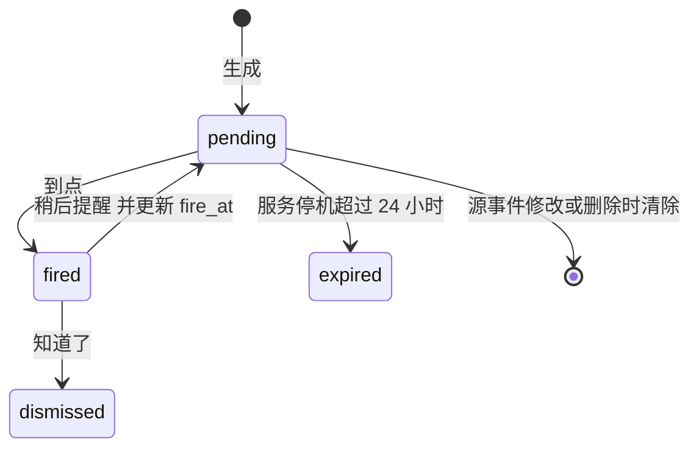
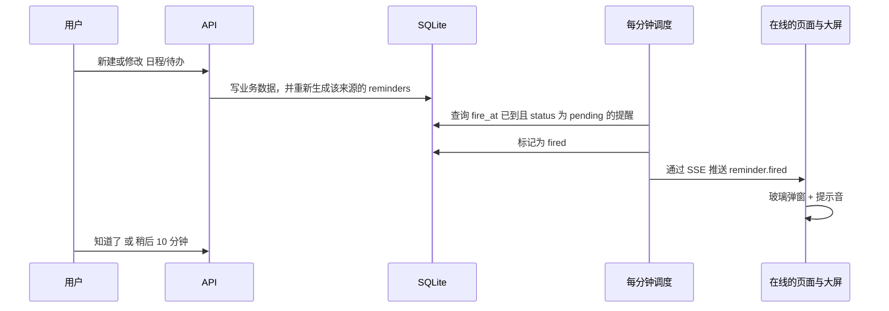

# 家庭大屏看板（Family Dashboard）技术设计

> 对应应用版本：v0.2.0（第一期已实现）　更新日期：2026-09-30
>
> 发布变更见 [更新日志](../CHANGELOG.md)，版本号以 Git 标签为准。
>
> 本文是项目的技术基线。实现过程中如有偏离（新增接口、改表结构、调整技术选型），必须同步更新本文。代码规范见根目录 [`AGENTS.md`](../AGENTS.md)。

## 目录

1. [目标与约束](#1-目标与约束)
2. [技术选型](#2-技术选型)
3. [总体架构](#3-总体架构)
4. [目录结构](#4-目录结构)
5. [功能模块设计](#5-功能模块设计)
6. [卡片框架](#6-卡片框架)
7. [数据模型与 API](#7-数据模型与-api)
8. [实时通道与页面内提醒](#8-实时通道与页面内提醒)
9. [主题与 Liquid Glass](#9-主题与-liquid-glass)
10. [大屏模式与 PWA](#10-大屏模式与-pwa)
11. [性能策略](#11-性能策略)
12. [认证与权限](#12-认证与权限)
13. [Docker Compose 部署](#13-docker-compose-部署)
14. [里程碑](#14-里程碑)
15. [工程规范](#15-工程规范)
16. [附录：第二期模块设计要点](#16-附录第二期模块设计要点)

---

## 1. 目标与约束

### 1.1 产品目标

一个部署在家用 NAS 或小服务器上、全家共用的信息大屏：

- 首页是 iOS / Android 风格的可拖拽小卡片，每张卡片展示某个功能的具体信息或汇总信息
- 每个功能都有完整的功能页（从侧边栏进入），也可以在首页点击卡片后从右侧抽屉快速操作
- 视觉风格以苹果 Liquid Glass 为默认主题，可以切换为其他主题
- 同一套页面同时服务于挂墙平板（大屏模式）、手机（PWA）和电脑浏览器

### 1.2 非功能约束

- **部署简单**：`docker compose up -d` 一条命令启动，单容器、单进程、单数据库文件，不依赖 Redis、消息队列、Postgres
- **响应快**：局域网内首屏小于 1 秒；二次打开（Service Worker 缓存命中）小于 300ms；常规交互小于 100ms
- **多用户**：家庭成员各自登录，每条数据可设为「私有」或「家庭共享」
- **可长时间运行**：挂墙平板 7x24 小时常亮，不能因内存增长或连接断开而卡死

### 1.3 分期范围

**第一期（本次实现，大屏基本功能）**

- 认证与多用户、成员管理
- 应用外壳：侧边栏导航 + 右侧抽屉
- 主题系统（Liquid Glass 浅色/深色及其他主题）
- 可拖拽卡片首页、卡片库
- 日程与待办
- 购物清单（多端实时同步）
- 页面内提醒（弹窗 + 提示音）
- 大屏模式（Kiosk）
- PWA
- Docker Compose 部署，通过 HTTP 内网地址访问
- Docker 部署与备份

**第二期（延后）**

- 手机推送（ntfy / Web Push）、每日摘要、免打扰
- 会员订阅（各网站、App 的会员有效期与花销）
- LLM Token 用量
- 跨模块聚合卡片（会员总花销、Token 总用量等）

**第一期为第二期预留的扩展点**

- **卡片注册表**：新模块只需注册自己的卡片，首页框架不用改
- **`reminders` 表与调度器**：第一期已经按时间生成并触发提醒，第二期只需在「触发」后面接上推送渠道
- **`/api/home` 聚合接口**：每个模块注册自己的汇总函数，新增模块只是多注册一个函数

基础功能支持 HTTP 内网访问。Service Worker、完整 PWA 安装和屏幕常亮（Wake Lock）依赖安全上下文及浏览器支持，采用渐进增强：不可用时给出提示，不阻断业务操作。开发时 `localhost` 被浏览器视为安全上下文，不能据此判断普通内网 IP 下的能力。

---

## 2. 技术选型

| 领域 | 选择 | 理由 |
| --- | --- | --- |
| 运行时 | Bun | 内置 SQLite、直接运行 TS、启动快、自带测试运行器；如遇兼容性问题可回退 Node 22 |
| 后端框架 | Hono | 轻量、类型友好、自带 SSE 流式工具 |
| 数据库 | SQLite（WAL 模式） | 单文件、零运维，家庭规模的读写量绰绰有余 |
| ORM | Drizzle ORM + drizzle-kit | 类型安全、接近 SQL、迁移文件可审阅 |
| 校验 | zod | schema 放在 `packages/shared`，前后端共用 |
| 前端 | React 19 + Vite + TypeScript | 生态成熟，构建快 |
| 样式 | Tailwind CSS v4 + CSS 变量 | 主题切换只需替换变量 |
| 基础组件 | Radix UI | 无样式、可访问性好，方便套玻璃风格 |
| 路由 | wouter | 约 2KB，替代 react-router 以满足首屏体积预算 |
| 卡片网格 | `react-grid-layout` | 拖拽与响应式断点；只在编辑模式按需加载，浏览时用 CSS Grid 渲染相同布局 |
| 服务端状态 | TanStack Query | 缓存、乐观更新、stale-while-revalidate |
| UI 状态 | Zustand | 轻量，只存界面状态 |
| 实时 | SSE（Server-Sent Events） | 单向推送已足够，比 WebSocket 更简单，穿透反向代理更容易 |
| 定时任务 | `croner` | 进程内调度，无需外部 cron |
| 重复规则 | `rrule` | 标准 RFC 5545 RRULE |
| 农历 | `Intl.DateTimeFormat('zh-CN-u-ca-chinese')` | 浏览器原生支持，零依赖 |
| PWA | `vite-plugin-pwa`（Workbox） | 自动生成 manifest 与 Service Worker |
| 格式化与 lint | Biome | 单一工具，速度快 |
| 第二期引入 | `web-push`、ntfy | 手机推送 |

---

## 3. 总体架构



- 同一个 Bun 进程同时提供静态资源、REST API、SSE 和定时任务
- 容器只暴露一个端口（默认 8686），客户端通过宿主机映射端口访问
- 所有外部数据（天气，第二期的 Token 用量）都由服务端拉取并缓存，前端永远只读本地数据，不会被第三方接口拖慢

### 3.1 一次典型请求



---

## 4. 目录结构

采用 Bun workspaces 的 monorepo：

```
family-dashboard/
  apps/
    web/                          # React SPA
      index.html
      vite.config.ts
      public/                     # 图标、提示音、默认壁纸
      src/
        main.tsx
        app/                      # 路由、应用外壳（侧边栏、抽屉、顶栏）
        components/               # 通用组件（Glass、Button、Sheet 等）
        lib/                      # api 客户端、SSE 客户端、时间工具
        modules/
          home/                   # 首页网格、编辑模式、卡片库
          calendar/
          shopping/
          settings/
          # 第二期新增 subscriptions/、tokens/
        widgets/                  # 卡片注册表、通用卡片容器、通用卡片（时钟、天气）
        themes/                   # 主题 CSS 变量
        pwa/                      # Service Worker 缓存规则
    server/                       # Hono 服务
      drizzle.config.ts
      src/
        index.ts                  # 启动入口：HTTP + 静态资源 + 定时任务
        routes/                   # 每个模块一个文件，只做参数解析和响应
        services/                 # 业务逻辑
        db/
          schema.ts
          migrations/
        jobs/                     # 提醒调度、备份、提醒滚动生成
        realtime/                 # SSE 连接管理与广播
        home/                     # /api/home 汇总函数注册表
        lib/                      # 鉴权、可见性过滤、错误处理
  packages/
    shared/                       # zod schema、类型、常量，前后端共用
  docker/
    Dockerfile
  .github/workflows/docker.yml    # 镜像自动构建
  docker-compose.yml              # 使用预构建镜像部署
  docs/
    TECH_DESIGN.md
    DEPLOY_DOCKER_COMPOSE.md      # 统一的 Docker Compose 部署指南
    DEPLOY_HTTPS.md               # 可选 HTTPS 配置指南
    CI_IMAGE.md                   # 镜像自动构建与发布流程
    images/                       # README 截图
  AGENTS.md
  biome.json
  .editorconfig
  tsconfig.base.json
  package.json
```

前端每个模块使用固定的子目录结构：

```
modules/<name>/
  pages/          # 完整功能页
  components/     # 模块内部组件
  widgets/        # 该模块提供的首页卡片
  drawer/         # 首页点击卡片时弹出的抽屉内容
  api.ts          # 调用后端的函数
  queries.ts      # TanStack Query 的 query key 工厂与 hooks
  index.ts        # 注册路由、卡片、抽屉
```

---

## 5. 功能模块设计

每个模块都包含三部分：

- **完整功能页**：从全局侧边栏进入，提供全部功能
- **侧边抽屉**：在首页点击卡片时从右侧滑出，显示快捷视图和常用操作，不离开首页
- **一组卡片**：注册到卡片库，用户自行挑选放到首页

### 5.1 应用外壳

- 左侧为玻璃质感的侧边栏：首页、日程、购物清单、设置；窄屏时收起为图标栏，手机上变为底部标签栏
- 右侧抽屉使用 Radix Dialog 实现，宽度 420px（手机上全屏），支持手势下滑或点击遮罩关闭
- 顶栏：当前用户头像（点击切换或退出）、离线提示、主题快捷切换

### 5.2 首页卡片

- **尺寸**：S(2x2)、M(4x2)、L(4x4)、XL(4x6)，单位为网格格子
- **编辑模式**：点击「编辑」进入，卡片轻微抖动（类似 iOS），此时可拖拽排序、删除，并通过卡片底部的 S / M / L / XL 按钮切换尺寸（只能切换到该卡片支持的尺寸，不做自由缩放）；点击「完成」保存，「取消」放弃修改
- **卡片库**：按模块分组，展示每张卡片的实时预览，点击或拖入即可添加；每张卡片可以单独配置（例如选哪个购物清单、显示哪些成员）
- **布局归属**：全家只有一个大屏布局，所有成员的首页和挂墙平板显示的都是它；任何成员都可以编辑，保存后通过实时通道同步到所有设备。卡片里的数据仍按可见性过滤，私有日程和清单只出现在本人的屏幕上
- **第一期提供的卡片**：

| 卡片 | 尺寸 | 说明 |
| --- | --- | --- |
| 时钟日期 | S / M | 时间、日期、星期、农历 |
| 天气 | S / M / L | 当前天气、今日温度区间，L 尺寸显示未来 5 天 |
| 今日日程 | S / M / L | 今天的事件列表 |
| 未来 7 天 | M / L | 按天分组的议程 |
| 家庭成员今日安排 | L / XL | 按成员分列显示今天的事件 |
| 下一件事 | S | 距离下一个事件的倒计时 |
| 待办 | M / L | 未完成的待办，可直接勾选 |
| 购物待买 | M / L | 指定清单的未买项，可直接勾选 |
| 未买总数 | S | 所有清单或指定清单的未买数量 |
| 多清单概览 | M | 每个清单的未买数量 |

### 5.3 日程与待办

**视图**

- 月、周、日、列表（议程）四种视图
- 每个成员有自己的颜色，事件按参与成员着色；支持按成员筛选
- 周视图和日视图显示当前时间线，点击空白时段即可在该时间新建日程；月视图点击某天进入该天的日视图
- 拖拽事件调整时间和时长尚未实现，计划在后续版本加入

**事件**

- 字段：标题、地点、备注、全天或时段、开始时间、结束时间、参与成员（多选）、可见性（私有/家庭）、颜色、提醒偏移
- 重复：提供常用预设（每天、工作日、每周、每两周、每月、每年），也支持自定义 RRULE
- 自定义 RRULE 只接受白名单字段（共用包 `rruleProblem` 校验）：频率限于每天/每周/每月/每年，`INTERVAL` 1–99、`COUNT` 1–1000，`UNTIL` 与 `COUNT` 二选一；`BYDAY` 只在每月/每年规则中允许序号（如 `-1FR`）；`BYMONTHDAY` 仅用于每月/每年、`BYMONTH` 仅用于每年，且日期必须在所选月份中存在；不支持 `BYSETPOS`、`BYHOUR` 等字段，按天间隔大于 1 时不能再限定星期。rrule 库遇到永远不匹配或负间隔的规则会长时间阻塞单线程进程，因此必须在入参阶段拒绝；服务端每次展开最多返回 2000 个实例
- 修改重复事件时询问范围：
  - **只改这一次**：生成一条覆盖事件，`parent_id` 指向原事件，`recurrence_id` 记录被替换的那次原定开始时间；原事件对应日期加入 `exdates`
  - **改这次及以后**：把原事件的 RRULE 在该日期前截断（设置 `UNTIL`），从该日期起新建一个重复事件
  - **改全部**：直接修改原事件
- 重复事件的展开在服务端完成：`GET /api/events?from&to` 返回的是区间内的具体实例，前端无需处理 RRULE

**时区**

- 家庭有一个统一时区（默认 `Asia/Shanghai`，在设置中修改）
- 时间一律以 UTC 毫秒时间戳存储；RRULE 按家庭时区展开，保证「每天早上 8 点」不会因时区换算漂移
- 全天事件以家庭时区的日期存储（`start_at` 为当天 00:00 对应的时间戳），展示时不做时区偏移

**待办**

- 不依附于日程的独立事项，例如「周五交电费」「给猫驱虫」
- 字段：标题、截止时间（可选）、指派成员、可见性、重复规则、提醒偏移
- 重复待办勾选完成后，自动生成下一次

**提醒偏移**

- 事件和待办都可以设置多个提醒：准时、提前 5 / 15 / 30 分钟、提前 1 小时、提前 1 天、自定义
- 第一期到点后以页面内提醒呈现（见第 8 节）

**快捷录入**

- 日程页和抽屉顶部有一个输入框，支持简单的中文自然语言：
  - `明天下午3点 家长会 提前1小时`
  - `每周六上午10点 游泳课 @小明`
  - `10月5日 全天 回老家`
- 使用本地规则解析（日期词、时间词、重复词、`@成员`、`提前X`），不依赖大模型
- 解析结果先以草稿卡片展示，用户确认或修改后再保存；解析不了的部分原样作为标题

### 5.4 购物清单

**清单**

- 可以建多个清单（超市、药店、宜家等），每个清单可设为家庭共享或私有，支持自定义图标、颜色和排序

**条目**

- 字段：名称、数量、单位、分类、备注、添加人、勾选状态、勾选人、勾选时间
- 分类内置：蔬果、肉蛋、水产、乳品、粮油、零食饮料、日用、清洁、母婴、药品、其他；可自定义

**交互**

- 输入框回车即添加；支持一次粘贴多行批量添加
- 支持输入「鸡蛋 2盒」自动拆出数量和单位
- 根据 `shopping_history` 自动归类：之前买过的东西沿用上次的分类
- 按分类分组显示；勾选后该项沉到分组底部并变灰；左滑删除（手机）或悬停显示删除按钮（电脑）
- 「清除已购」：把已勾选的条目归档（设置 `archived_at`），同时累加到 `shopping_history`

**常购联想**

- 输入时按「名称前缀匹配 + 购买次数 + 最近购买时间」排序给出补全
- 清单顶部显示「常买」快捷标签（最近 30 天购买次数最多的 10 项），点一下即加入

**实时协同**

- 任何写操作成功后，服务端广播 `shopping.item.created / updated / deleted` 事件
- 前端收到事件后直接更新 TanStack Query 缓存，不重新请求
- 勾选采用乐观更新；同一条目被两人同时修改时，以后写入者为准

**超市模式**

- 全屏、大字号、只显示未买项，勾选区域加大，方便边走边勾；自动申请屏幕常亮

### 5.5 设置

- **成员管理**（管理员）：新增成员、重置密码、设置头像和颜色、设为管理员
- **个人设置**：头像、颜色、密码、默认首页
- **外观**：主题、壁纸、性能模式、深色模式自动切换时段
- **家庭设置**（管理员）：家庭时区、天气城市（经纬度）
- **大屏设备**（管理员）：生成配对码、查看在线状态、吊销设备
- **数据**（管理员）：立即备份、下载备份、导出 JSON；重置数据（清空数据或恢复出厂，需输入「重置」并再次输入管理员密码，执行前自动备份）

---

## 6. 卡片框架

### 6.1 注册表

前端用一张注册表统一描述所有卡片，首页框架只认注册表，不认识具体模块：

```ts
registerWidget({
  type: 'calendar.upcoming',
  title: '未来 7 天',
  module: 'calendar',
  sizes: ['M', 'L'],
  defaultSize: 'M',
  configSchema: z.object({
    days: z.number().int().min(1).max(14).default(7),
    members: z.array(z.string()).optional(),
  }),
  component: UpcomingWidget,
  drawer: 'calendar',
})
```

- `type`：全局唯一，格式为 `<模块>.<卡片名>`
- `sizes`：支持的尺寸；缩放时只能吸附到这些尺寸
- `configSchema`：卡片配置的 zod schema，用于校验与填充默认值；配置不合法时自动回退到默认配置
- `ConfigEditor`（可选）：编辑配置的组件，例如选择显示哪个购物清单；没有该组件的卡片不显示设置按钮
- `component`：接收 `{ size, config }`，自行通过 TanStack Query 读取数据
- `drawer`：点击卡片时打开的抽屉，不填则跳转到模块功能页

每张卡片外层由统一的 `WidgetFrame` 包裹，负责玻璃背景、标题、加载骨架、错误兜底（单张卡片出错不影响整个首页）。

### 6.2 网格与断点

| 断点 | 宽度 | 列数 | 典型设备 |
| --- | --- | --- | --- |
| `lg` | ≥ 1200px | 12 | 横屏平板、电脑 |
| `md` | 768 – 1199px | 8 | 竖屏平板 |
| `sm` | < 768px | 4 | 手机 |

- 行高根据容器宽度动态计算，保证格子为正方形；手机（`sm`）上行高最少 80px，避免中号卡片过矮
- 列表类卡片（今日日程、近期日程、待办、购物待买等）按卡片实际高度显示尽可能多的完整条目，放不下的整条隐藏，不会出现被截断的半行
- 布局按断点分别保存；某个断点没有布局时，从较大断点自动推导

### 6.3 数据加载

- `/api/home` 一次返回首页所需的全部数据，按模块分组：

```json
{
  "members": [],
  "calendar": { "rangeStart": 0, "rangeEnd": 0, "instances": [], "todos": [] },
  "shopping": { "lists": [], "pendingItems": { "<listId>": [] } }
}
```

- `calendar.instances` 为今天起 14 天内已展开的日程实例，今日日程、近期日程、下一项等卡片都从中筛选
- 天气不放在 `/api/home` 中，而是单独走 `/api/weather`（服务端缓存 30 分钟），避免第三方接口拖慢首页

- 服务端每个模块注册一个汇总函数 `registerHomeContributor('calendar', (ctx) => ...)`，`/api/home` 并行调用所有汇总函数后合并返回
- 前端把这份数据写入各模块对应的 query key，卡片组件通过 `select` 取自己需要的部分；之后的实时更新走各模块自己的 query

### 6.4 存储

- `dashboards`：只有一行，id 固定为 `family`；`layouts` 为 `{ lg: Layout[], md: Layout[], sm: Layout[] }`，其中 `Layout` 为 `{ i, x, y, w, h }`
- `widgets`：每张卡片一行，`id` 与布局中的 `i` 对应，保存 `type` 和 `config`
- 保存布局时整体替换（`PUT /api/dashboard`），家庭规模下无需增量更新

---

## 7. 数据模型与 API

### 7.1 通用约定

- 主键：使用 UUIDv7（`Bun.randomUUIDv7()`），天然按时间排序
- 时间：一律为 UTC 毫秒时间戳（`integer`）；每张表都有 `created_at`、`updated_at`
- 可见性：`visibility` 取值为 `private` 或 `family`
- JSON 字段：以 `text` 存储，由 Drizzle 的 `mode: 'json'` 自动序列化
- 数据库列名为 snake_case，Drizzle 映射为 camelCase

### 7.2 第一期表结构



| 表 | 主要字段 | 说明 |
| --- | --- | --- |
| `users` | id, username, name, avatar, color, role(`admin`/`member`), password_hash, prefs(JSON：主题、壁纸、夜间自动深色、性能模式、折射效果) | 家庭成员 |
| `sessions` | id, user_id, token_hash, expires_at, user_agent | 登录会话，只存令牌的哈希 |
| `devices` | id, name, token_hash, last_seen_at, revoked_at | 大屏设备，只读显示全家共用的大屏 |
| `pairing_codes` | code, expires_at | 大屏配对码，5 分钟有效 |
| `settings` | key, value(JSON) | 家庭级设置：时区、天气位置、夜间深色时段、大屏外观与夜间模式 |
| `events` | id, owner_id, visibility, title, location, note, color, start_at, end_at, all_day, rrule, exdates(JSON), parent_id, recurrence_id, remind_offsets(JSON) | 日程 |
| `event_participants` | event_id, user_id | 参与成员 |
| `todos` | id, owner_id, visibility, title, due_at, rrule, assignee_ids(JSON), remind_offsets(JSON), done_at | 待办 |
| `shopping_lists` | id, owner_id, visibility, name, icon, color, sort | 购物清单 |
| `shopping_items` | id, list_id, name, qty, unit, category, note, added_by, checked, checked_by, checked_at, archived_at | 购物条目 |
| `shopping_history` | key(规范化名称，主键), name, category, count, last_at | 联想与自动归类 |
| `dashboards` | id(固定为 `family`), layouts(JSON，按断点) | 全家共用的大屏布局，只有一行 |
| `widgets` | id, dashboard_id, type, config(JSON) | 卡片实例 |
| `reminders` | id, source_type(`event`/`todo`), source_id, occurrence_at, user_id, fire_at, status, fired_at, payload(JSON：标题、开始时间、地点、是否家庭可见) | 提醒；payload 是生成时的快照，弹窗无需再查源数据 |

**索引**

- `events(start_at)`、`events(parent_id)`、`event_participants(user_id)`
- `shopping_items(list_id, archived_at)`
- `reminders(status, fire_at)`、`reminders(source_type, source_id)`
- `sessions(token_hash)`、`devices(token_hash)`

**`reminders.status` 状态流转**



**第二期新增**：`push_channels`、`notification_log`、`subscriptions`、`llm_providers`、`token_snapshots`（见第 16 节）。

### 7.3 第一期 API

所有接口前缀为 `/api`，请求和响应均为 JSON。错误统一返回：

```json
{ "error": { "code": "NOT_FOUND", "message": "日程不存在" } }
```

**认证**

| 方法 | 路径 | 说明 |
| --- | --- | --- |
| GET | `/auth/status` | `{ initialized, registrationOpen }`：是否已有管理员、是否开放自助注册 |
| POST | `/auth/setup` | 创建第一个管理员，仅在无用户时可用 |
| POST | `/auth/register` | 管理员开启自助注册后注册普通成员；请求体 `{ username, name, password }`，成功返回 `201` 和 `MeResponse`，写入会话 Cookie；未开放时返回 `403` |
| POST | `/auth/login` | 用户名密码登录，写入会话 Cookie |
| POST | `/auth/logout` | 退出 |
| GET | `/me` | 当前用户或当前设备 |
| PATCH | `/me` | 修改个人资料、密码 |

**成员、设备与设置**

| 方法 | 路径 | 说明 |
| --- | --- | --- |
| GET / POST | `/users` | 成员列表 / 新增成员（管理员） |
| PATCH / DELETE | `/users/:id` | 修改 / 删除成员（管理员） |
| GET | `/devices` | 大屏设备列表（管理员） |
| POST | `/devices/pairing-code` | 生成配对码（管理员） |
| POST | `/devices/pair` | 大屏用配对码换取设备令牌 |
| DELETE | `/devices/:id` | 吊销设备（管理员） |
| GET / PATCH | `/settings` | 家庭级设置（修改需管理员）；PATCH 为部分更新，未传的字段（含嵌套对象内的字段）保持原值；`allowRegistration` 控制自助注册，默认关闭 |

**日程与待办**

| 方法 | 路径 | 说明 |
| --- | --- | --- |
| GET | `/events?from&to` | 区间内的事件实例（已展开重复，最长 120 天）；按成员筛选在前端完成 |
| GET | `/events/:id` | 单个事件（存储形态，未展开） |
| POST | `/events` | 新建事件 |
| PATCH | `/events/:id?scope=this\|following\|all&occurrence=` | 修改事件，重复事件需带 `scope` 和实例时间 |
| DELETE | `/events/:id?scope=this\|following\|all&occurrence=` | 删除事件 |
| GET | `/todos?status=open\|done` | 待办列表 |
| POST | `/todos` | 新建待办 |
| PATCH / DELETE | `/todos/:id` | 修改 / 删除待办 |
| POST | `/todos/:id/done` | 请求体 `{ done: boolean }`；完成重复待办时顺延到下一次截止时间，不关闭 |
| POST | `/parse` | 快捷录入解析，返回草稿，不落库 |

**提醒**

| 方法 | 路径 | 说明 |
| --- | --- | --- |
| GET | `/reminders/active` | 当前用户已触发但未处理的提醒（最近 24 小时） |
| POST | `/reminders/:id/dismiss` | 知道了 |
| POST | `/reminders/:id/snooze` | 稍后提醒，默认 10 分钟，可传 `minutes` |

**购物清单**

| 方法 | 路径 | 说明 |
| --- | --- | --- |
| GET / POST | `/lists` | 清单列表 / 新建清单 |
| PATCH / DELETE | `/lists/:id` | 修改 / 删除清单 |
| GET | `/lists/:id/items` | 清单条目（不含已归档） |
| POST | `/lists/:id/items` | 添加条目，支持数组批量添加 |
| PATCH / DELETE | `/items/:id` | 修改（含勾选） / 删除条目 |
| POST | `/lists/:id/clear-checked` | 归档已勾选条目 |
| GET | `/shopping/suggest?q` | 输入联想 |
| GET | `/shopping/frequent` | 常买标签 |

**首页与其他**

| 方法 | 路径 | 说明 |
| --- | --- | --- |
| GET | `/home` | 首页聚合数据 |
| GET | `/dashboard` | 获取全家共用的大屏布局与卡片（成员和大屏设备均可） |
| PUT | `/dashboard` | 保存布局与卡片（任何成员，大屏设备不可） |
| GET | `/weather` | 天气（服务端缓存 30 分钟） |
| GET | `/stream` | SSE 实时通道 |
| POST | `/uploads` | 上传头像、壁纸（限制 5MB，仅图片），文件通过 `/uploads/<name>` 访问 |
| GET / POST | `/backups` | 备份列表 / 立即备份（管理员） |
| GET | `/backups/:name` | 下载备份文件（管理员） |
| GET | `/export` | 导出全部数据为 JSON，不含密码哈希和令牌（管理员） |
| POST | `/admin/reset` | 重置数据（管理员）。请求体 `{ mode, password, confirm }`：`mode` 为 `content`（清空日程、待办、提醒、购物清单和首页布局，保留账号、设置和大屏设备）或 `factory`（删除全部数据并回到初始化页面）；需要管理员密码，`confirm` 必须为「重置」。执行前自动备份，每分钟最多 5 次 |
| GET | `/health` | 健康检查，供 Docker 使用 |

---

## 8. 实时通道与页面内提醒

### 8.1 SSE 通道

- 每个浏览器标签页只建立一条 `EventSource('/api/stream')` 连接，所有模块共用，由 `lib/realtime.ts` 分发给订阅者
- 服务端在内存中维护连接表：`Map<connectionId, { userId | deviceId, stream }>`
- 广播时按可见性过滤：只发给有权限看到这条数据的用户，以及（家庭可见数据时）所有大屏设备
- 事件格式：

```
event: shopping.item.updated
id: 01927f3a-...
data: {"listId":"...","item":{...}}
```

- 事件类型（第一期）：
  - `shopping.list.changed`、`shopping.item.created`、`shopping.item.updated`、`shopping.item.deleted`
  - `calendar.changed`（前端收到后让相关日期区间的查询失效并重新请求）
  - `todo.changed`
  - `dashboard.changed`（大屏布局被修改时，所有在线页面和大屏自动刷新布局）
  - `reminder.fired`
  - `data.reset`（管理员重置数据后发出：清空数据时各页面重新拉取，恢复出厂时各页面清空本地缓存并回到初始化或配对页）
- 稳定性：
  - 每 20 秒发送一次心跳注释行（`: ping`），防止反向代理和 Bun 的空闲超时断开连接
  - `Bun.serve` 的 `idleTimeout` 默认只有 10 秒，需要调大到 120 秒
  - 响应头加 `Cache-Control: no-cache` 与 `X-Accel-Buffering: no`，防止 中间层缓冲
  - 前端断线由 `EventSource` 自动重连；重连成功后让所有查询失效并补拉一次，保证不漏数据
- 身份绑定：
  - 连接的可见范围在建立时按当前用户或设备确定。服务端每次心跳前重新校验会话或设备 Cookie，身份失效（退出、过期、改密）或变化即关闭连接；删除用户、重置其密码、撤销设备时立即关闭对应连接
  - 前端按当前身份（用户 ID 或设备 ID）建立连接：身份变为未登录或切换为其他账号时先断开再重连，避免下一位使用者继承上一位的私有推送

### 8.2 页面内提醒



**提醒生成**

- 事件或待办每次写入时，先删除该来源所有 `pending` 状态的提醒，再按「实例时间 − 提醒偏移」重新生成
- 接收人：事件的所有参与成员（没有参与成员时为创建人）；待办的指派成员（没有指派时为创建人）
- 重复事项只生成未来 60 天内的提醒；每天凌晨 3 点的任务滚动补齐下一段

**提醒触发**

- `croner` 每分钟执行一次：取出 `status = 'pending' AND fire_at <= now` 的提醒，批量更新为 `fired`，按用户推送 `reminder.fired`
- 家庭可见事项的提醒同时推送给所有大屏设备
- 服务启动时：`fire_at` 早于 24 小时前的未触发提醒标记为 `expired`，其余立即按正常流程触发

**提醒展示**

- 页面收到 `reminder.fired` 后弹出玻璃风格的提醒卡片，显示标题、时间、地点，播放提示音
- 操作：「知道了」（dismiss）、「稍后 10 分钟」（snooze，把提醒改回 `pending` 并推迟 `fire_at`）、「查看详情」
- 多条提醒同时到达时堆叠显示
- 页面打开或 SSE 重连时，调用 `/api/reminders/active` 补齐期间错过的提醒，所以离线期间的提醒不会丢
- 大屏上的「知道了」只在该大屏本地隐藏（记在 localStorage），不影响成员自己设备上的提醒状态

**提示音与浏览器限制**

- 浏览器禁止页面在用户交互前自动播放声音。大屏首次进入时显示一个「点击启用声音」按钮，点击后预热 `AudioContext`，之后即可正常播放
- 手机和电脑上，只要用户在当前页面有过任意点击，提示音即可播放；否则只显示弹窗

**第二期衔接**

- 第二期在调度器的「标记为 fired」之后增加一步「按用户已绑定渠道分发」，`reminders` 表结构不变

---

## 9. 主题与 Liquid Glass

### 9.1 主题变量

所有颜色、圆角、模糊、阴影都定义为 CSS 变量，通过 `<html data-theme="...">` 切换，组件中只引用变量：

```css
[data-theme='liquid-glass-light'] {
  --bg-wallpaper: url('/wallpapers/default-light.webp');
  --glass-bg: rgb(255 255 255 / 0.28);
  --glass-border: rgb(255 255 255 / 0.55);
  --glass-highlight: rgb(255 255 255 / 0.7);
  --glass-shadow: 0 8px 32px rgb(0 0 0 / 0.12);
  --glass-blur: 24px;
  --glass-saturate: 180%;
  --radius-card: 24px;
  --text-primary: rgb(0 0 0 / 0.88);
  --text-secondary: rgb(0 0 0 / 0.55);
  --accent: #0a84ff;
}
```

Tailwind v4 通过 `@theme` 把这些变量映射为工具类（例如 `bg-glass`、`text-secondary`、`rounded-card`），业务代码中禁止出现硬编码颜色。

### 9.2 内置主题

| 主题 | 说明 |
| --- | --- |
| `liquid-glass-light` | 默认浅色玻璃 |
| `liquid-glass-dark` | 深色玻璃，夜间默认 |
| `classic` | 不透明卡片，传统风格 |
| `minimal` | 极简白底，弱化装饰 |
| `wall-display` | 高对比、大字号，适合远距离观看 |

### 9.3 玻璃效果实现

统一由 `<Glass>` 组件实现，所有卡片、侧边栏、抽屉、弹窗都复用它：

- 半透明背景：`background: var(--glass-bg)`
- 背景模糊与增饱和：`backdrop-filter: blur(var(--glass-blur)) saturate(var(--glass-saturate))`
- 顶部高光：`box-shadow: inset 0 1px 0 var(--glass-highlight), var(--glass-shadow)`
- 边缘描边：1px 渐变边框（上亮下暗），模拟光线折射的边缘
- 折射增强（可选）：在 Chromium 内核浏览器中叠加 SVG `feDisplacementMap` 滤镜，让背景在卡片边缘产生轻微扭曲；Safari 和 Firefox 自动降级为普通模糊

### 9.4 动效与壁纸

- 卡片圆角 24px；按压时轻微缩放（0.97）；抽屉和弹窗使用 iOS 风格的弹簧曲线（CSS `linear()` 缓动函数）
- 支持内置壁纸和自定义上传；壁纸是玻璃效果的基础，默认提供几张色彩丰富的渐变壁纸
- 深色模式可以跟随系统，也可以按时段自动切换（例如 22:00 – 07:00 使用深色）

### 9.5 性能模式

- `backdrop-filter` 在低端安卓平板上开销较大。设置中提供「性能模式」开关：开启后改用不透明的纯色背景，关闭模糊和折射滤镜
- 计划中：首次在大屏上打开时测量帧率，过低时提示开启性能模式（尚未实现）

---

## 10. 大屏模式与 PWA

### 10.1 大屏模式（Kiosk）

**配对与登录**

1. 管理员在「设置 → 大屏设备」中点击「添加设备」，得到一个 6 位配对码（5 分钟有效）
2. 平板打开 `http://服务器内网IP:8686/kiosk`，输入配对码
3. 服务端下发长期有效的设备令牌（HttpOnly Cookie），设备只能以只读身份查看大屏
4. 管理员可以随时吊销设备

**页面行为**

- 全屏显示与成员首页相同的大屏布局，隐藏侧边栏和编辑入口；点击卡片仍可打开只读抽屉
- 数据通过 SSE 实时更新，另外每 5 分钟静默刷新一次作为兜底
- 每天凌晨 4 点整页重载一次，释放长时间运行积累的内存，同时应用新版本
- 屏幕常亮：使用 Wake Lock API，页面切回前台时自动重新申请；夜间时段主动释放
- 夜间模式：可设定时段（默认 23:00 – 06:30）调暗屏幕或只显示大时钟；夜间点一下屏幕可临时唤醒 5 分钟
- 平板把 PWA 安装到桌面后，以 `standalone` 方式打开，没有浏览器地址栏

**已知限制**

- iOS 18.4 之前，主屏幕 PWA 中的 Wake Lock 存在缺陷。iPad 建议同时在系统设置中把「自动锁定」设为「永不」，并开启「引导式访问」锁定在本应用
- 安卓平板如需开机自启、防止误退出，可配合 Fully Kiosk Browser 一类的专用浏览器

### 10.2 PWA

**manifest**

- 应用名「家庭看板」，短名「看板」
- 图标：192、512 两种尺寸，外加 maskable 版本
- `display: standalone`，`start_url: /`，`theme_color` 随当前主题动态更新
- `shortcuts`：提供「大屏模式」（`/kiosk`）、「购物清单」两个快捷入口

**iOS 适配**

- `apple-touch-icon`（180x180）
- `apple-mobile-web-app-status-bar-style: black-translucent`，让壁纸延伸到状态栏下方，配合玻璃风格
- 使用 `env(safe-area-inset-*)` 处理刘海和屏幕圆角

**Service Worker 缓存策略**

缓存规则集中写在 `apps/web/src/pwa/cache-rules.ts`：

| 资源 | 策略 | 说明 |
| --- | --- | --- |
| HTML、JS、CSS、字体、图标 | 预缓存 | 构建时生成清单，二次打开无需请求网络 |
| `GET /api/*` 读接口 | 网络优先，3 秒超时回退缓存 | 离线时仍能看到最近一次的日程和购物清单 |
| 写接口（POST / PATCH / PUT / DELETE） | 不缓存 | 直接走网络 |
| `/api/stream` | 不缓存 | SSE 长连接 |
| `/api/auth/*`、`/api/me` | 不缓存 | 防止退出后仍读到旧身份 |
| 天气、头像、壁纸 | stale-while-revalidate | 先用缓存，后台更新 |

- 退出登录时清空 API 缓存，防止下一个人看到上一个人的私有数据

**离线体验**

- 顶部显示「离线」玻璃提示条
- 离线时禁用所有写操作按钮（第一期不做离线写入队列，避免多端同步冲突）

**版本更新**

- 检测到新版本的 Service Worker 时，弹出提示「有新版本，点击刷新」
- 大屏模式下不打扰，等到凌晨整页重载时自动生效

**开发环境**

- `bun dev` 下默认不启用 Service Worker，避免缓存干扰调试
- 需要调试 PWA 时使用 `bun run build && bun run preview`

---

## 11. 性能策略

**前端**

- 各模块路由懒加载；首屏 JS（gzip 后）控制在 150KB 以内，当前约 138KB
- 只在需要时加载的部分：拖拽网格（编辑模式）、弹窗与抽屉组件、日程与待办编辑器、卡片库、各功能页
- 首页只调用一次 `/api/home` 聚合接口
- TanStack Query 采用 stale-while-revalidate，并通过 `persistQueryClient` 持久化到 IndexedDB：打开页面立即渲染上次的数据，再在后台刷新
- 所有写操作使用乐观更新，界面不等待服务端返回
- 长列表（例如列表视图的日程）使用虚拟滚动
- 静态资源文件名带 hash，配合长期缓存；Service Worker 预缓存后二次打开几乎不依赖网络

**后端**

- SQLite 开启 `journal_mode = WAL`、`synchronous = NORMAL`，热点查询使用 prepared statements
- 为所有过滤和排序字段建立索引（见 7.2）
- 重复事件展开结果在内存中按「事件 id + 区间」做短期缓存，写入时失效
- 外部数据（天气）由服务端缓存 30 分钟，前端不直接等待第三方接口
- 启用 gzip / brotli 压缩（由反向代理或 Hono 中间件处理）

**性能目标**

| 指标 | 目标 |
| --- | --- |
| 首屏可交互（局域网，首次访问） | < 1s |
| 二次打开（缓存命中） | < 300ms |
| 常规 API 响应（服务端耗时） | < 20ms |
| 购物清单跨设备同步延迟 | < 1s |
| 大屏连续运行 7 天 | 内存无持续增长 |

---

## 12. 认证与权限

**账号与会话**

- 用户名 + 密码登录，密码使用 `Bun.password`（argon2id）哈希
- 登录成功后生成随机令牌，数据库只存其 SHA-256 哈希；令牌写入 HttpOnly、`SameSite=Lax` 的 Cookie，`Secure` 属性按当前访问协议设置
- 会话有效期 30 天，使用期间自动续期
- 登录和注册分别限流：同一客户端每分钟各最多 10 次。客户端按 TCP 对端地址识别；只有对端地址在 `TRUSTED_PROXIES`（默认仅本机回环地址）中时，才读取 `X-Forwarded-For` 中最靠近服务端的非可信地址或 `X-Real-IP`。直连时客户端可以任意伪造这些头，信任它们会让攻击者绕过限流或把全家锁在外面

**初始化**

- 首次访问时没有任何用户，页面引导创建第一个管理员（`/auth/setup`）；此后该接口关闭
- 自助注册默认关闭，由管理员在「设置 → 家庭 → 家庭成员」中开关（家庭设置 `allowRegistration`）。默认部署是局域网 IP 直连，开放注册意味着任何能访问看板的人都能成为成员并读取家庭共享数据，因此建议家人注册完成后关闭
- 开放期间，登录页显示「注册家庭成员」入口（`/register`），填写名字、用户名、密码和确认密码，注册成功后自动登录并进入首页；未开放时隐藏入口，直接访问注册页显示联系管理员的提示，接口返回 `403`，且在哈希密码之前拒绝。管理员始终可在设置中创建成员或调整角色
- `/auth/register` 仅接收共用 schema 定义的用户名、名字和密码，服务端固定写入 `member`；客户端附带 `role: admin` 不会获得管理员权限。普通成员不能通过个人资料接口自行提升角色
- 未初始化时注册接口返回 `409`，注册失败返回 `403`/`409` 时前端刷新初始化状态，未初始化则跳转到 `/setup`；初始化后访问 `/setup` 跳转到 `/login`，已登录用户访问登录、注册或初始化页则回到首页，大屏设备回到 `/kiosk`
- 用户名去除首尾空白并转为小写，重名返回 `409`；输入校验失败返回 `400`，超出注册限流返回 `429`，均使用统一中文错误响应
- 密码哈希完成后，在同步数据库事务中重新检查初始化状态、创建账号并签发会话；并发初始化仅一个管理员创建成功，同名并发注册仅一个成功，其余返回冲突
- 注册成功广播 `members.changed`，其他设备刷新成员列表；注册接口归入现有 `/api/auth/*` 的 Service Worker 不缓存规则。注册页面按需加载，沿用认证成功后清空客户端缓存的流程
- 注册成功即加入当前家庭，可访问家庭共享数据；私有数据继续按现有可见性规则过滤。当前没有邀请码或审批步骤，准入只靠管理员开关

**角色**

- `admin`：管理成员、大屏设备、家庭设置、备份
- 所有成员：编辑全家共用的大屏布局
- `member`：管理自己的数据和家庭共享数据
- 大屏设备：只读，只能访问首页相关的读接口和 SSE

**数据可见性**

一条数据对当前用户可见，当且仅当满足以下任一条件：

- 自己是创建人（`owner_id`）
- `visibility = 'family'`
- 自己是该事件的参与成员，或该待办的指派成员

家庭共享的数据所有成员都可以修改，私有数据只有创建人可以修改。所有查询都必须经过 `lib/visibility.ts` 中的统一过滤函数，禁止在各处手写条件。

**CSRF**

- Cookie 使用 `HttpOnly` 和 `SameSite=Lax`。写接口在携带 `Origin` 时，要求与当前请求的外部协议、Host（含端口）一致，或匹配配置的 `PUBLIC_URL` 来源；其他来源拒绝。反向代理需覆盖并传递正确的转发头。

---

## 13. Docker Compose 部署

完整操作步骤统一维护在 [Docker Compose 部署指南](DEPLOY_DOCKER_COMPOSE.md)，仓库根目录的 [docker-compose.yml](../docker-compose.yml) 为配置入口。技术设计不再重复维护平台专用安装步骤。

可选 HTTPS 入口的证书、反向代理、双协议会话及验收要求统一维护在 [HTTPS 配置指南](DEPLOY_HTTPS.md)。看板进程继续提供 HTTP，由外部代理终止 TLS。

- 单个容器运行 Bun 服务、React 静态资源、SQLite 和定时任务，默认通过 `http://服务器内网IP:8686` 访问。
- 默认 Compose 固定使用 `ghcr.io/dddyszy/family-dashboard:v0.2.0`，升级时修改镜像标签；工作流发布目标为 `linux/amd64` 和 `linux/arm64`。仅推送 `v*` Git 标签触发构建，并生成同名镜像标签；正式语义化版本更新 `latest`，预发布版本不更新。推送 `master` / `dev` 均不构建。发布规则见 [镜像自动构建](CI_IMAGE.md)。
- Compose 的 `environment` 直接填写配置，不依赖额外环境变量文件。生产环境要求 `APP_SECRET` 至少 32 个字符；IP 直连时 `PUBLIC_URL` 留空。经反向代理访问时，把代理连到看板时的来源地址填入 `TRUSTED_PROXIES`（逗号分隔的精确 IP），限流才能区分真实客户端；不填时所有经代理的请求共用一个限流桶。
- `./data:/app/data` 保存数据库、上传文件及数据库快照；镜像以 root 运行以适配 NAS 本地目录权限。数据使用本地文件系统，不让多个运行实例共享同一数据库。
- 镜像自带 `/api/health` 健康检查。修改环境变量、挂载、端口或镜像后需要用 `docker compose up -d` 重建，普通重启不应用这些配置变更。
- 程序按启动时读取的家庭时区，每天 02:00 生成一致性数据库快照，保留最近 7 份。手动和迁移前快照同样计入保留数量，完整备份还需保存上传文件与 Compose 配置。
- 首次启动自动迁移；已有数据库且存在待执行迁移时先备份数据库。升级前仍应完成外部备份并记录镜像版本，回退时恢复配套数据库。
- 前端新增卡片使用 `crypto.getRandomValues()` 生成 UUIDv4，ID 同时用于卡片实例和布局项，支持普通 HTTP 访问。
- 浏览器增强功能按 `window.isSecureContext` 与 API 可用性检测；设置页显示能力及离线准备状态，大屏与超市模式提示常亮不可用的原因，不影响基础业务功能。

---

## 14. 里程碑

### 第一期：大屏基本功能

| 里程碑 | 内容 | 验收标准 |
| --- | --- | --- |
| M0 | 项目脚手架（`AGENTS.md`、Biome、TS strict、`bun run check`）、PWA 基础（manifest、图标、Service Worker 骨架）、认证与成员管理、主题系统、应用外壳（侧边栏 + 抽屉） | 可以初始化管理员、创建成员、登录，切换主题；`bun run check` 通过 |
| M1 | 卡片网格框架、布局持久化、编辑模式、卡片库，时钟和天气卡片 | 可以添加、拖拽、缩放、删除卡片，刷新后布局保持；三个断点下都正常 |
| M2 | 购物清单、SSE 实时同步、购物卡片 | 两台设备实时同步；常买联想可用；首页卡片可直接勾选 |
| M3 | 日程（四种视图、重复规则、参与成员）、待办、快捷录入、日程卡片 | 重复事件三种修改范围正确；快捷录入覆盖常见句式；相关单元测试齐全 |
| M4 | 提醒调度、页面内提醒弹窗与提示音 | 到点 1 分钟内弹窗；稍后提醒可用；离线期间的提醒在重新打开后补齐 |
| M5 | 大屏模式（配对、Wake Lock、夜间模式）、完善 PWA 缓存与更新提示、Docker 发布、Docker Compose 部署文档、备份 | 部署自检清单全部通过；大屏连续运行 7 天无异常 |

先做购物清单（M2）再做日程（M3），是因为购物清单链路最短，能尽早验证 SSE 实时同步和卡片框架这两块基础设施。

### 第二期

| 里程碑 | 内容 |
| --- | --- |
| M6 | 手机推送（ntfy / Web Push，直接复用第一期的 Service Worker）、每日摘要、免打扰 |
| M7 | 会员订阅模块及卡片 |
| M8 | Token 用量适配器、快照、趋势卡片 |
| M9 | 跨模块聚合卡片（会员总花销、Token 总用量） |

---

## 15. 工程规范

完整规范见根目录 [`AGENTS.md`](../AGENTS.md)，Cursor 等 AI 工具会自动读取，开发者同样照此执行。原则是：能由工具检查的规则都交给工具强制执行，`AGENTS.md` 只写工具管不到的约定。

**强制工具**

- **Biome**：格式化、lint、import 排序。风格：2 空格缩进、单引号、不加分号、行宽 100
- **TypeScript**：`strict: true`、`noUncheckedIndexedAccess: true`，禁止 `any`
- **`bun run check`**：依次执行 `biome check`、`tsc --noEmit`（各 workspace）、`bun test`；任何改动完成前都必须通过
- **`.editorconfig`**：LF 换行、UTF-8、文件末尾保留换行

**必须有单元测试的逻辑**

- 重复事件展开与三种修改范围
- 提醒生成与状态流转
- 快捷录入解析
- 可见性过滤
- 购物条目的数量与单位拆分、自动归类

---

## 16. 附录：第二期模块设计要点

以下内容仅用于确保第一期的设计不会堵死第二期，第二期开始前再细化。

### 16.1 手机推送

- 新增 `push_channels`（user_id, kind: `ntfy` / `webpush`, ntfy_topic 或 Web Push 的 endpoint 与密钥, enabled）和 `notification_log`
- 调度器在「标记为 fired」之后，按用户已绑定且启用的渠道分发
- Web Push 使用 VAPID，密钥首次启动时自动生成并存入 `settings`；iOS 需要 16.4 以上，并先把 PWA 添加到主屏幕
- 每日摘要：每人可设定推送时间（默认 08:00），内容为当天日程和待办
- 免打扰时段内的提醒延后到时段结束时发送

### 16.2 会员订阅

- 新增 `subscriptions`（owner_id, visibility, name, icon, price, currency, cycle, start_date, expire_date, auto_renew, remind_days, note）
- 到期前 N 天生成 `source_type = 'subscription'` 的提醒，复用第一期的调度器
- 卡片：即将到期列表、单个会员倒计时、月度/年度总花销（按人或按类别）

### 16.3 LLM Token 用量

- 新增 `llm_providers`（owner_id, type, name, api_key_enc, base_url, low_balance_threshold）和 `token_snapshots`（provider_id, date, model, input_tokens, output_tokens, cost, balance）
- API 密钥使用 `APP_SECRET` 派生的 AES-GCM 密钥加密存储
- Provider 适配器接口：`fetchBalance()`、`fetchUsage(range)`；每小时拉取一次写入每日快照
- 首批支持：OpenAI（Usage / Costs API，需要 Admin Key）、Anthropic（Usage & Cost Admin API，需要 Admin Key）、DeepSeek / Moonshot / SiliconFlow / OpenRouter（余额接口）；其他服务支持手动录入
- 余额低于阈值时生成 `source_type = 'token'` 的提醒
- 卡片：本月花费、各服务余额、7 / 30 天趋势、低余额告警

### 16.4 聚合卡片

- 服务端新增 `/api/stats/*` 或直接作为 `/api/home` 的汇总函数，前端注册 `summary.*` 类型的卡片，例如「本月会员 + Token 总支出」
